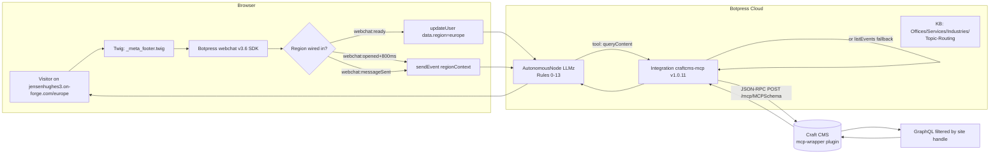
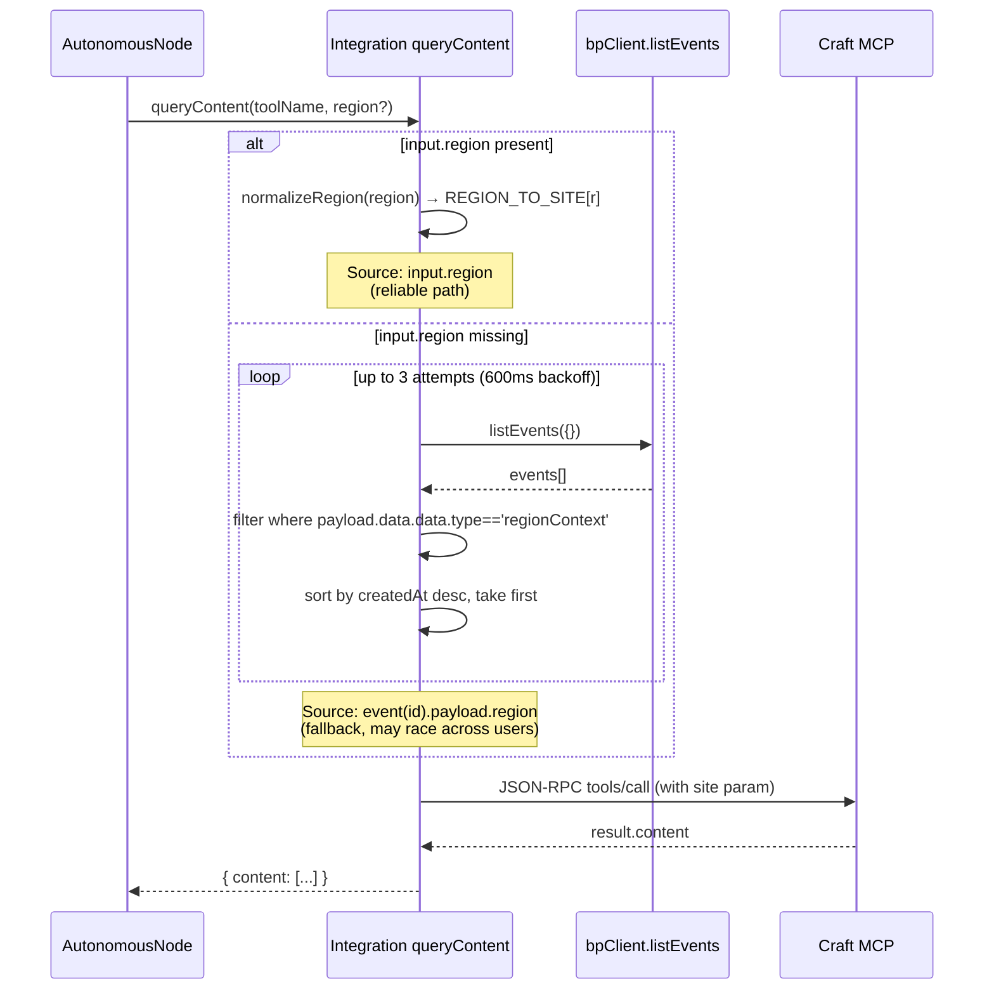
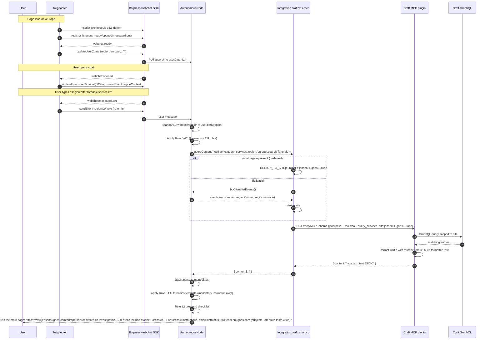

# Jensen Hughes Botpress — Architecture (V6.7)

**Last updated:** 2026-05-20
**Audience:** technical (Liz/future-Liz/handoff). Terse. file:line refs throughout.
**Scope:** Twig wrapper → Botpress webchat → Botpress integration → MCP/Craft → response. Covers regional filtering shipped 2026-05-18/19.

---

## TL;DR

JH visitor lands on a Craft CMS regional site (e.g. `/europe`) → Twig footer embeds Botpress webchat v3.6, computes region server-side from `currentSite.handle`, writes it into `user.data` via `updateUser` after `webchat:ready`, and emits a `regionContext` custom event after `webchat:opened` + on every `webchat:messageSent`. Bot's AutonomousNode (Botpress LLMz) reads region from `workflow.region` (or `user.data.region`), calls `queryContent` on the integration; the integration passes `region` straight to MCP **or** falls back to scanning `listEvents` for the most recent `regionContext` event when the bot forgets. MCP server (a Craft plugin) translates to GraphQL → returns scoped, formatted JSON. Bot composes a reply per the V6.7 prompt (Rules 0–13).



---

## Components

### 1. Craft wrapper site (the Twig that mounts the bot)

**Repo:** `/Volumes/LizsDisk/Herd/jensenhughes` (Bitbucket: rocketparkllc).
**Bot embed:** `templates/_partials/_meta_footer.twig:33-147` (also at `templates/_meta_footer.twig:42-143`).
**Gate (staging only):** `_meta_footer.twig:34` — `serverName in ['jensenhughes.test', 'jensenhughes3.on-forge.com', 'staging3.jensenhughes.com']`. **Prod (`www.jensenhughes.com`) is NOT in the gate.** Bot stays on staging.

#### Server-side region derivation (`_meta_footer.twig:37-52`)

```twig




  
    
  
    
  
    
  
    
  
    
  

```

#### Region → user.data lifecycle (`_meta_footer.twig:96-131`)

Three triggers. All idempotent. Comments (verified 2026-05-19 via direct probe) capture the SDK quirks:

| Event | What fires | Why |
|---|---|---|
| `webchat:ready` | `fireUpdateUser()` | SDK fully mounted. `updateUser({data})` → `PUT /users/me` `{userData: …}`. Pre-mount calls silently queue+drop. |
| `webchat:opened` | `fireUpdateUser()` + `setTimeout(fireSendEvent, 800)` | Conversation exists. 800ms gives SDK time to publish. |
| `webchat:messageSent` | `fireSendEvent()` | Defense-in-depth — re-emits regionContext so integration's listEvents fallback always finds a recent payload. |

`fireSendEvent` payload (verified the SDK wraps in an extra `data`):

```js
window.botpress.sendEvent({
  data: {
    type: 'regionContext',
    region, siteHandle, urlPrefix, language
  }
});
// Botpress serializes as payload = { type:'custom', data: { data: {...} } }
// Integration reads payload.data.data.type (see src/index.ts:217)
```

**Why both updateUser AND sendEvent:** `updateUser.data` is what `getUserData` returns in the bot's Standard1 node where region is read into `workflow.region` — but Standard1 only runs at conversation start. `sendEvent` writes a queryable event the integration's `listEvents` fallback can scan on every tool call. Belt + suspenders.

### 2. Botpress integration (TypeScript, the bridge)

**Repo:** `/Volumes/LizsDisk/mcp-wrapper/botpress-integration`
**Package:** `craftcms-mcp` v1.0.11 (`integration.definition.ts:5`)
**Build:** `bp deploy` (artifact in `.botpress/`, gitignored)
**Configuration schema** (`integration.definition.ts:11-15`):
- `mcpServerUrl` — defaults `https://servicecurator.com`. JH bot uses `https://jensenhughes3.on-forge.com`.
- `schemaHandle` — defaults `public`. JH uses `MCPSchema` (or `ai`).

#### Actions (`integration.definition.ts:18-131`)

| Action | Purpose | Used by bot? |
|---|---|---|
| `listTools` | Discovery — returns all MCP tools available on the schema | Diagnostics |
| **`queryContent`** | The workhorse. Calls any MCP tool by name with normalized args | YES — every tool call |
| `getEntry` | Single entry by ID | Rare |
| `intelligentSearch` | NL search wrapper | Not used in current flow |
| `answerQuestion` | KB+LLM hybrid wrapper | Not used in current flow |

#### `queryContent` input schema (key bits)

| Field | Purpose |
|---|---|
| `toolName` | Which MCP tool to invoke (`query_services`, `craft_get_office_contact_info`, `craft_resolve_regional_url`, …) |
| `region` | **IMPORTANT** — bot reads `{{user.data.region}}` and passes it. Allowed: europe/pacific/asia/middle_east/north_america. Auto-derives `site`. |
| `site` | Craft site handle (e.g. `jensenHughesEurope`). Bot rarely passes directly; integration derives from `region`. |
| `search`, `slug`, `id`, `status`, `limit`, `offset`, `orderBy`, `section`, dates | Standard Craft filters |

#### Region resolution chain (`src/index.ts:148-276`)



**Region map** (`src/index.ts:171-176`):

```ts
const REGION_TO_SITE = {
  europe: 'jensenHughesEurope',
  pacific: 'jensenHughesPacific',
  asia: 'jensenHughesAsia',
  middle_east: 'jensenHughesMiddleEast',
};
// north_america/americas/"" → no site param (defaults to primary)
```

**Event reader** (`src/index.ts:207-230`) — checks **all** of these payload shapes for robustness:
1. `payload.data.data.type === 'regionContext'` ← real SDK shape (Twig path)
2. `payload.data.type === 'regionContext'` ← legacy/server-posted
3. Bare `region` at any of 3 depths ← defensive

**Race / multi-user caveat** (`src/index.ts:202-206`): under concurrent traffic from different regions, the most-recent event may not belong to the calling user. Accepted tradeoff until off AutonomousNode (no per-arg Manual mode means no per-user state).

#### Tool-specific massaging in integration (post region resolution)

| Tool | What integration does | Why |
|---|---|---|
| `craft_get_office_contact_info` (`src/index.ts:283-300`) | Normalizes `slug` to single string, passes through | Office tool has simpler signature |
| `query_ourTeam` (`src/index.ts:303-421`) | **Hybrid filter:** name-search hits ALL members; expertise-search filters to Regional Leadership only; browse-mode = Regional Leadership only | Lets users find named experts (Sean Lebel) AND prevents random staff from appearing on "fire experts" queries |
| `query_officeLocations` with `search` (`src/index.ts:424-end`) | Fetches up to 100, filters by title/slug/summary/region title client-side, **then enriches each result with phone+address by calling `craft_get_office_contact_info`** | Eliminates the "phone not listed" answer when LLM picks `query_officeLocations` instead of the contact tool |

#### User tags schema (`integration.definition.ts:138-157`)

Declared in integration definition — but **the Twig writes to `user.data`, not tags** (per code comment on `_meta_footer.twig:80-83`: SDK drops tag writes on PUT /users/me). Tags schema is dormant.

### 3. MCP server (Craft side — the data plane)

**Repo:** `/Volumes/LizsDisk/mcp-wrapper` (composer package: `rocket-park/mcp-wrapper`, installed into Herd/jensenhughes via `composer.json`)
**Endpoint:** `https://jensenhughes3.on-forge.com/mcp/MCPSchema` (also alias `/mcp/ai`)
**Schema:** `MCPSchema` — 18 sections exposed (out of 75+ in Craft). Listed in `JENSEN-HUGHES-IMPLEMENTATION.md:59-71`.
**Auth:** GraphQL token via `MCP_GQLSCHEMA_TOKEN` env var.

#### Tools (17 total — verified prod 2026-02)

**Auto-generated `query_*` from GraphQL schema** (9):
`query_countries`, `query_industries`, `query_insights`, `query_officeLocations`, `query_ourTeam`, `query_pages`, `query_podcastEpisodes`, `query_podcasts`, `query_services`.

Also exposed on JH: `query_leadershipTeams`, `query_certifiedCompanies` (per V6 prompt Rule 2).

**Custom PHP `#[Tool]` (8):**
- `craft_search_entries` — full-text across sections (fallback when `query_*` search is weak)
- `craft_get_entry_by_slug` / `craft_get_entry_by_id`
- **`craft_get_office_contact_info`** — bot's preferred path for office contact (returns phone, address, maps, contactForm; **never returns emails**)
- **`craft_resolve_regional_url`** — verifies a service URL exists per region. Returns `{available, url, fallbackUrl, matchedSlug, matchedTitle, description}`. Bot uses this BEFORE emitting any `/services/*` URL it didn't get from a query result. Source of truth doc: `docs/TOOL-DESIGN-craft_resolve_regional_url.md`.
- `craft_get_system_info`, `craft_list_plugins`, `craft_get_cache_info`, `craft_get_project_config_status` — diagnostic only

**Dangerous tools (blocked in prod):** `craft_clear_caches`, `craft_rebuild_config`, `craft_run_queue` (`JENSEN-HUGHES-IMPLEMENTATION.md:481-487`).

#### GraphQL schema scope (`JENSEN-HUGHES-IMPLEMENTATION.md:425-451`)

YAML at `config/project/graphql/schemas/{uid}.yaml`. **Fail-safe is "allow none"** (was "allow all", caused Jan 26 incident where all 75+ tools leaked). Always run `php craft project-config/apply` after schema changes.

#### Response shape

```json
{ "content": [{ "type": "text", "text": "<JSON-stringified payload>" }] }
```

Bot MUST `JSON.parse(resp.content[0].text)` to access `entries`, `formattedText`, `formattedCount` (V6 Rule 1).

`formattedText` (newly added in V5/V6) is pre-built markdown with regional URLs already substituted — bot can splice directly into reply without rebuilding links.

### 4. Botpress bot (the brain — Studio cloud, not in repo)

**Studio URL:** `https://studio.botpress.cloud/208ffbe5-a209-4a10-a52c-d79de4577f45`
**Workspace ID:** `wkspace_01KCPQEH096HZE66R7G994M5SR`
**Bot ID:** `208ffbe5-a209-4a10-a52c-d79de4577f45`
**KB:** Services KB id `kb_01KH6JEBHYXFE3W42Q49S44K2S`
**Webchat asset (prod CDN, served on staging):** `https://files.bpcontent.cloud/2025/12/17/17/20251217175917-M8VO1C7X.js`

**Bot architecture:** Single AutonomousNode (LLMz) — 100% LLM-driven, no per-arg Manual mode. All region/region-restriction/URL-discipline logic is **prompt-driven**, not code-driven. See memory `feedback_botpress_autonomous_node.md`.

**Source-of-truth prompt mirror:** `botpress-integration/AUTONOMOUS-NODE-INSTRUCTIONS-V6.md` (the file Liz pastes into Studio).

#### V6.7 Rules (13 rules, paraphrased — full text in V6.md)

| Rule | What |
|---|---|
| **0** | REGION HARD CONTRACT. Resolve from `workflow.region` (preferred) or `user.data.region`. `americas`==`north_america`. Every queryContent gets `region`. **5 hardcoded literal service-landing URLs** per region — bot copies verbatim, no string concat. |
| **1** | TOOL RESPONSE PARSING. JSON.parse `content[0].text`. Case A (yes/no question) = conversational + ONE URL required. Case B (list ask) = dump `formattedText`. Case C (zero) = Rule 10 fallback. |
| **2** | TOOL CHOICE. KB → MCP tool → contact fallback. Table mapping topic → preferred tool. URL enforcement: slugs come from tool responses or `craft_resolve_regional_url`. |
| **3** | OFFICE CONTACT. Always `craft_get_office_contact_info` FIRST. **Never expose slugs** to user (titles only). Disambiguation prompts list titles. |
| **4** | REGIONAL SERVICE RESTRICTIONS. Authoritative NOT-available lists per region (EU: Accessibility/Security/EmMgmt; Pacific: EmergingHazards/Energy/Security/EmMgmt/Forensics/Process Safety; Asia: Accessibility/Security/EmMgmt/Forensics/LSFT; ME: Forensics). Fixed phrasing. |
| **5** | FORENSICS. Step 1 region check (Pacific/Asia/ME → NOT available message). Step 2 routing template per region. EU MUST include `instructus.uk@jensenhughes.com`. No `/scotland` ever. |
| **6** | BIM = `bimfire` one word. Exact insights URL. Never fire-engineering page. |
| **7** | STYLE. Lead with answer in 1–2 sentences + ONE link. **Every substantive reply ends with a jensenhughes.com URL.** Privacy refusal must include `info@jensenhughes.com` verbatim. |
| **8** | REMOVED (was "Did this answer your question?" tail — gone in V6.5). |
| **9** | OFF-TOPIC. Politely deflect jokes/weather/pricing/competitors. **Careers/hiring is ON-topic.** |
| **10** | EMPTY RESULTS / TOPIC ROUTING. ~20-row topic→service-page table (BESS→Lithium-Ion, Dust→Combustible Dust Safety, LSFT→LSFT page, LNG→Process Safety, …). 5 regional fallback templates with hardcoded URLs. |
| **11** | TOPIC ISOLATION. New question = fresh topic unless user bridges. |
| **12** | PRE-SEND CHECKLIST. Scan for `$`/`{`/HTML entities, internal slugs, one-link conformance, region match, Rule 8 tail. |
| **13** | REGION SCOPE COVERS ALL CONTENT. Industries, careers, contact, insights, digital, about — not just services. |

**Identity** (`AUTONOMOUS-NODE-INSTRUCTIONS-V6.md:319-323`): "Jensen Hughes AI Assistant on jensenhughes.com. Founded 1939 | 100+ offices | 100+ countries | ~1,900 employees | 450+ committee memberships | HQ: Columbia, MD."

#### Knowledge Bases (3 active)

| KB | id | What |
|---|---|---|
| Offices | (synced via `scripts/sync-offices-to-botpress.js`) | All 97 offices. Weekly sync. |
| Services | `kb_01KH6JEBHYXFE3W42Q49S44K2S` | Service descriptions + `botpress-topic-routing.txt` (9.3 kB, 33 verified-prod topic→URL mappings) |
| Industries | (synced via `scripts/sync-industries-to-botpress.js`) | 13 industry verticals |

KB priority is **KB → MCP tool → contact fallback** (V6 Rule 2). Bot is forbidden from using general AI knowledge.

---

## End-to-end sequence — single user question



---

## Versioning & deploy

| Layer | Where | How to bump |
|---|---|---|
| Twig footer | `Herd/jensenhughes/templates/_partials/_meta_footer.twig` | git push → Forge auto-deploy |
| MCP wrapper (PHP) | composer dep `rocket-park/mcp-wrapper` | `composer update rocket-park/mcp-wrapper` in Herd/jensenhughes, push to trigger Forge |
| Botpress integration (TS) | `mcp-wrapper/botpress-integration` | `./scripts/bp-deploy-safe.sh` (snapshots bot config, runs `bp deploy`, diffs after — catches config-reset). Plain `bp deploy` works too but no safety net. |
| AutonomousNode prompt | Studio paste from `AUTONOMOUS-NODE-INSTRUCTIONS-V6.md` | Studio → AutonomousNode → Instructions → paste lines 11+ → Save → **Publish bot** |
| KB topic-routing | `data/botpress-topic-routing.txt` | Studio → Services KB → Add doc → upload file → wait Indexed |
| Webchat snippet (CDN) | `files.bpcontent.cloud/.../20251217175917-M8VO1C7X.js` | Studio → Webchat config → Save → CDN URL refreshes; update Twig if URL changes |

**Staging gate:** `_meta_footer.twig:34` allowlists `jensenhughes.test`, `jensenhughes3.on-forge.com`, `staging3.jensenhughes.com`. **Production hostname not yet added.** Bot is staging-only until Jonathan/John signs off prod rollout.

---

## Test suite

**File:** `scripts/regression/jh-bot-regression.mjs` (Playwright, 50 scenarios, ~10 min full run)

**Run:**
```bash
cd /Volumes/LizsDisk/mcp-wrapper
playwright install chromium  # once
node scripts/regression/jh-bot-regression.mjs              # full
node scripts/regression/jh-bot-regression.mjs --region EU  # filter
node scripts/regression/jh-bot-regression.mjs --tag forensics
node scripts/regression/jh-bot-regression.mjs --ids EU-marine-forensics,NA-podcast
node scripts/regression/jh-bot-regression.mjs --verbose
```

**Coverage matrix:**

| Tag | Regions | Asserts |
|---|---|---|
| `forensics` | NA/EU/Pacific/Asia/ME | Correct primary URL, EU includes instructus.uk@, NOT-available phrasing, no /scotland |
| `accessibility` | EU/Pacific/Asia/ME | Region availability, /middle-east/ prefix for ME |
| `fire-engineering` | EU/Pacific/Asia/ME | Regional URL prefix, no fabricated global slug |
| `restriction` | EU/Pacific | Security/EmMgmt restriction phrasing |
| `office` | NA/EU/ME/Pacific | Rule 3 format, no slug leaks |
| `bim` | NA | `bimfire` (one word) URL |
| `privacy` | NA | Refuses personal email, includes info@ |
| `aldiana-v6` | NA/Pacific | BESS/Dust/LSFT/LNG/Sydney-disambig/no-list-dump/EU-BIM |
| `region-surface` | All | Industries/Digital/Insights/Careers/About/Contact per region |
| `jonathan` | NA/EU | Marine forensics May 13 complaint |
| `podcast`, `careers`, `multi-part` | NA | Misc gap coverage |

**Last run:** 49/50 PASS (98%). The single FAIL is LLM nondeterminism on `Asia-fire-eng` — re-run before treating as real.

**Race gotcha** (regression README): Twig sendEvent regionContext takes ~8–10s to populate `workflow.region`. Script waits 12s. Going under 10s causes random fails.

**Webchat user persistence:** cookies/localStorage/sessionStorage cleared between region switches (Botpress webchat persists anonymous user by cookie; previous user.data leaks otherwise).

---

## Configuration / secrets reference (names only)

| Secret/env | Where | Purpose |
|---|---|---|
| `MCP_GQLSCHEMA_TOKEN` | Forge env for jensenhughes3 | GraphQL token, linked to MCPSchema |
| `BOTPRESS_PAT` | Forge scheduler + Liz local | KB sync scripts |
| `BOTPRESS_BOT_ID` = `208ffbe5-a209-4a10-a52c-d79de4577f45` | docs/scripts | Bot reference |
| `BOTPRESS_WORKSPACE_ID` = `wkspace_01KCPQEH096HZE66R7G994M5SR` | docs | Workspace reference |
| Forge HTTP basic auth (staging) | regression script (`STAGING_URL`, `HTTP_AUTH`) | gates `jensenhughes3.on-forge.com` |

**No secrets in this doc.** All values stay in Forge env / 1Password / Botpress Studio.

---

## Known issues / open items

| # | Item | Status |
|---|---|---|
| 1 | Typing indicator during MCP tool calls (Botpress only shows during LLM token generation, not during 1–3 s tool latency) | Platform limit. Workaround: flow-level "Looking up..." intermediate msg. Not built. |
| 2 | Response speed ~35–45s end-to-end | Always Alive ($5/mo) deferred pending Jonathan. MCP tool cache wired but only helps repeat-arg queries. |
| 3 | Utah LSFT lab page | Content gap on prod (Sarah Pichardo). Not a bot bug. |
| 4 | Footer "Need to speak with someone?" text non-clickable | Botpress webchat v3 platform limit. |
| 5 | Production hostname not in Twig gate | Awaiting John/Jonathan sign-off. |
| 6 | Asia-fire-eng regression nondeterminism | ~5% false-fail rate from LLM. Re-run policy on the suite. |
| 7 | listEvents fallback is cross-user under concurrent traffic | Accepted tradeoff until off AutonomousNode (no per-arg Manual mode). |
| 8 | User tags schema declared but unused (Twig writes to user.data only) | Could remove from `integration.definition.ts:138-157` — currently dead. |

---

## Quick-reference: where to look when…

| Symptom | Look at |
|---|---|
| Bot says "North America" for a European user | Open browser console on `/europe`, confirm `window.botpress` exists; in Botpress Studio Conversation log check user.data.region; check integration log for "Auto-derived site=" line (`src/index.ts:274`) |
| Bot emits `${prefix}` or `{region}` literal | Rule 0 / Rule 12 prompt violation — re-paste V6 prompt or check that Studio Publish actually ran |
| Bot says office phone "not listed" | Did LLM pick `query_officeLocations` instead of `craft_get_office_contact_info`? Integration enriches `query_officeLocations` results since `src/index.ts:468-end`, so should be fine. Check MCP response in logs. |
| Bot emits a slug like "sydney-castlereagh-street" in chat | Rule 3 violation — check that V6 prompt is in Studio (V5 didn't have the slug-leak ban) |
| Bot answers with "I couldn't find anyone" instead of routing | Rule 10 topic-routing table miss. Check `data/botpress-topic-routing.txt` is uploaded to Services KB + Indexed. |
| Webchat doesn't appear | Browser is on a hostname not in the Twig allowlist (`_meta_footer.twig:34`). Add hostname or test on staging. |
| sendEvent race (region missed) | Wait ≥10 s between page-load and first user message (12 s in regression). Reproducible only on cold sessions; reload fixes for that user. |

---

## File map (single source of truth per concern)

| Concern | File |
|---|---|
| **Bot embed + region detection** | `Herd/jensenhughes/templates/_partials/_meta_footer.twig` |
| **Integration definition (actions, schemas)** | `mcp-wrapper/botpress-integration/integration.definition.ts` |
| **Integration logic (region resolution, tool massaging)** | `mcp-wrapper/botpress-integration/src/index.ts` |
| **AutonomousNode prompt (paste-ready)** | `mcp-wrapper/botpress-integration/AUTONOMOUS-NODE-INSTRUCTIONS-V6.md` |
| **Prompt changelog** | `mcp-wrapper/botpress-integration/V6-CHANGELOG.md` |
| **KB topic routing** | `mcp-wrapper/data/botpress-topic-routing.txt` |
| **MCP server (PHP, Craft plugin)** | `mcp-wrapper/src/` (PHP) |
| **Regression suite** | `mcp-wrapper/scripts/regression/jh-bot-regression.mjs` |
| **KB sync scripts** | `mcp-wrapper/scripts/sync-{offices,services,industries}-to-botpress.js` |
| **MCP architecture doc (Feb 2026 baseline)** | `mcp-wrapper/JENSEN-HUGHES-IMPLEMENTATION.md` |
| **Regional URL tool design** | `mcp-wrapper/docs/TOOL-DESIGN-craft_resolve_regional_url.md` |
| **KB strategy** | `mcp-wrapper/docs/BOTPRESS-KB-STRATEGY.md` |
| **V6.7 handoff** | `mcp-wrapper/V6-HANDOFF.md` |
| **V6.7 John update** | `mcp-wrapper/V67-JOHN-UPDATE.md` |
| **V6.7 ClickUp closeout** | `mcp-wrapper/V67-CLICKUP-COMMENTS.md` |
